## COUPONG (쿠퐁)

- 개요 : 쿠폰 발행 / 사용 / 관리를 위한 시스템   
- 개발 환경
> Windows 10 / PHP 7.2 / Laravel 5 / MariaDB 10
- 설치& 방법  

> 프로젝트 다운로드 후, install 폴더의 config.zip 를 프로젝트 폴더에 압축 해제  
> .env 파일의 MySQL DB 정보를 수정  

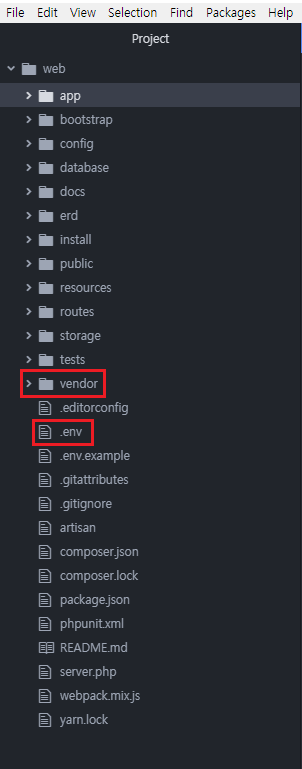
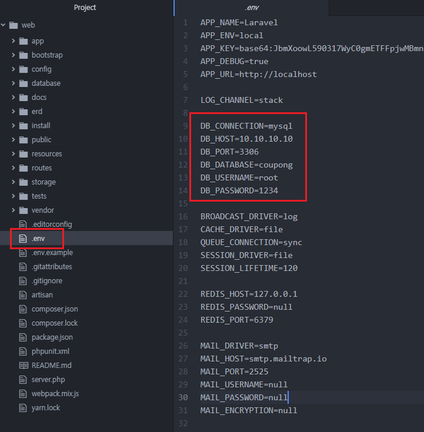

> 테스트 서버 구동 방법
> {프로젝트 경로}/php artisan serve --port={포트번호}

### ERD 설계

> DB 스키마  
https://github.com/black4309/coupong/blob/master/docs/DB_%EC%8A%A4%ED%82%A4%EB%A7%88.sql

> 초기 데이터 (MEMBER 테이블 데이터이며, 모든 멤버의 패스워드는 1234)  
https://github.com/black4309/coupong/blob/master/docs/%EC%B4%88%EA%B8%B0_%EB%8D%B0%EC%9D%B4%ED%84%B0.sql

> 논리적 스키마 설계
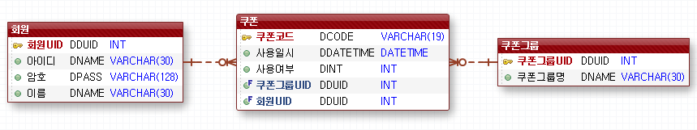

> 물리적 스키마 설계
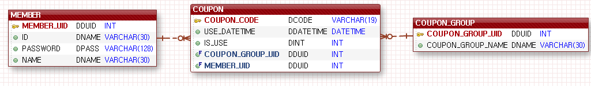
  

### 로그인 페이지

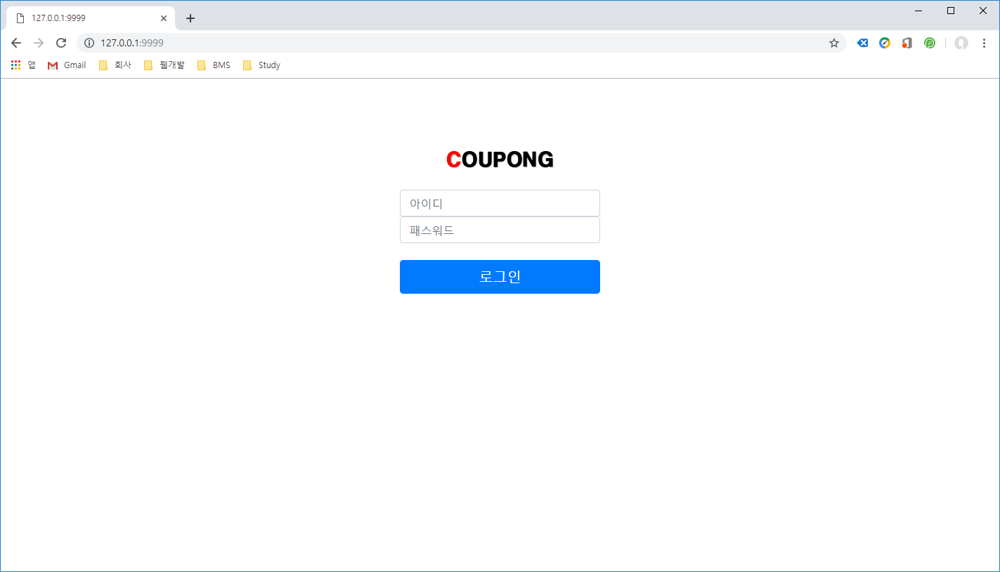

> 관리자 / 일반 회원 로그인하며, 각자 다른 메뉴 노출

- 암호화 : 로그인 시, 암호는 SHA512 를 이용하여  
- 관리자 : 쿠폰 발행, 쿠폰 리스트 조회, 쿠폰 통계  
- 사용자 : 쿠폰 사용

### 관리자 - 메인 화면

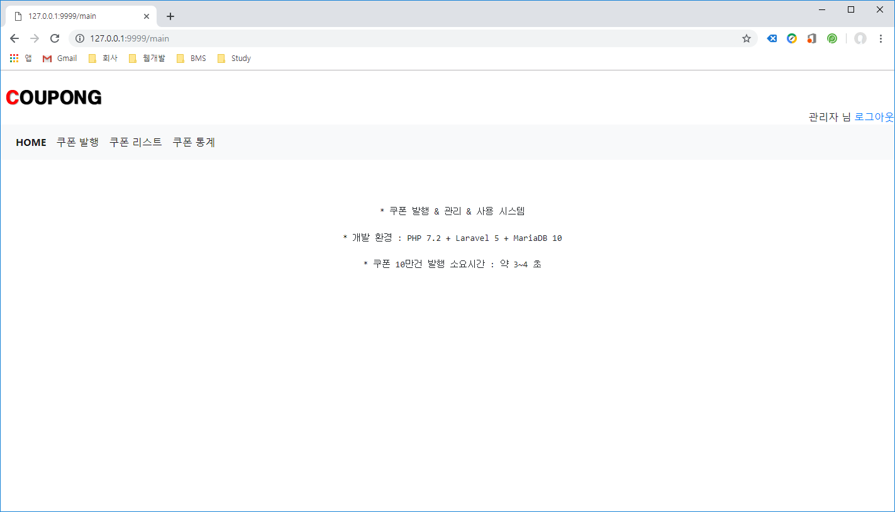

- 메뉴 구성 : 쿠폰 발행, 쿠폰 리스트 조회, 쿠폰 통계

### 관리자 - 쿠폰 발행

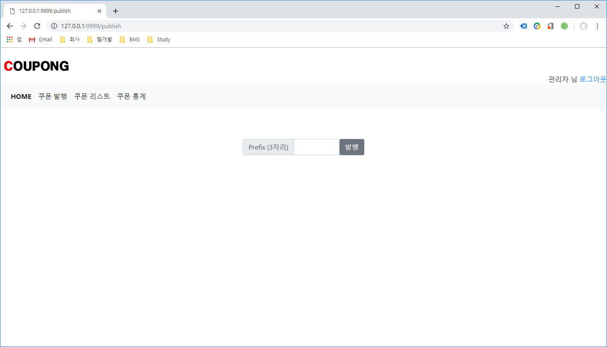

- PREFIX 를 앞 3자리 고정으로 하여 10만건의 쿠폰을 생성  
- 10만건의 쿠폰 중, 20% 의 랜덤 확률로 쿠폰이 사용으로 적용됨
- 10만건 쿠폰 생성 소요 시간 (약 3 ~ 4초)

### 관리자 - 쿠폰 리스트 조회

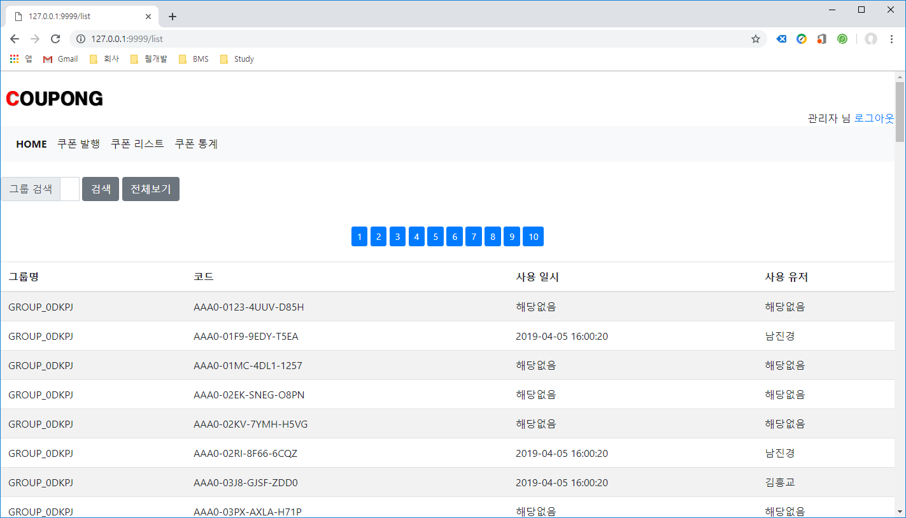

- 100 건씩 페이징 처리 (이전/다음/끝으로 가기는 추후 기능 추가 필요)  
- 그룹명으로 검색 가능

### 관리자 - 쿠폰 통계

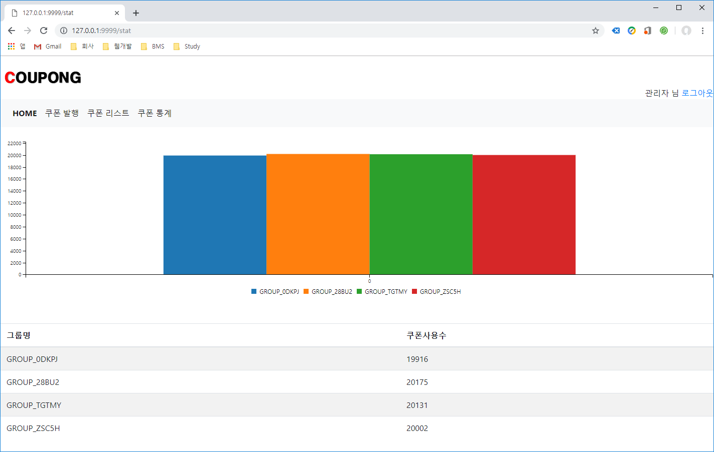

- 쿠폰그룹 별로 쿠폰 사용 개수를 차트로 화면에 출력

### 일반회원 - 메인화면

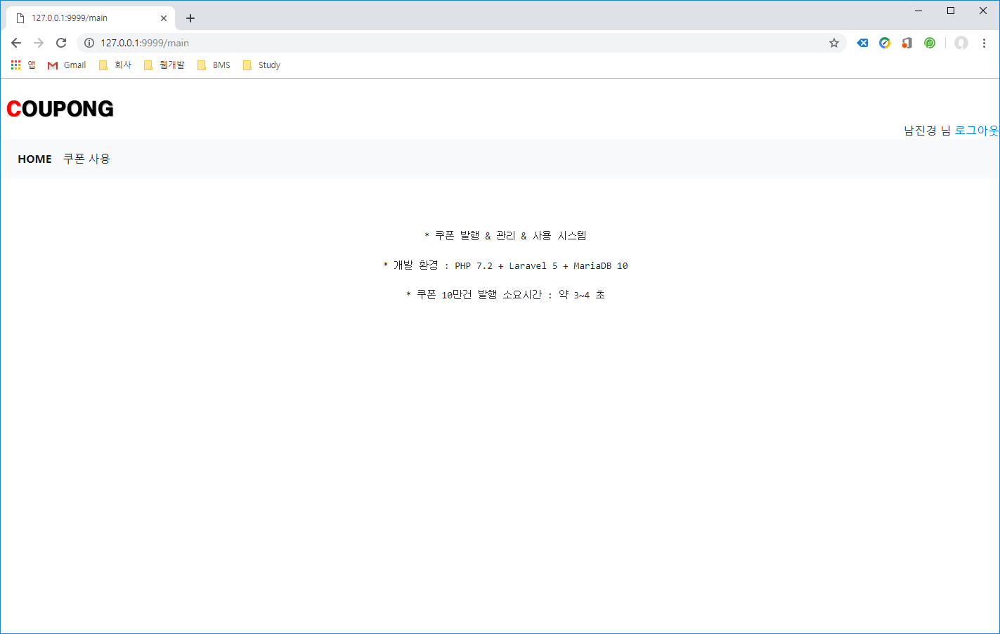

- 메뉴 구성 : 쿠폰 사용

### 일반회원 - 쿠폰 사용

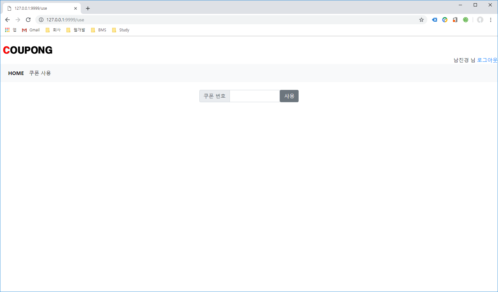

- 쿠폰 존재 여부 확인 가능
- 쿠폰이 사용 여부 확인 가능
